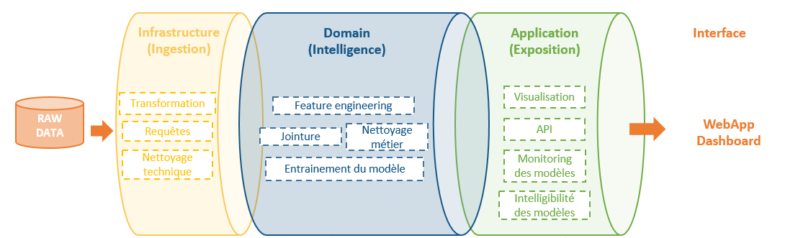
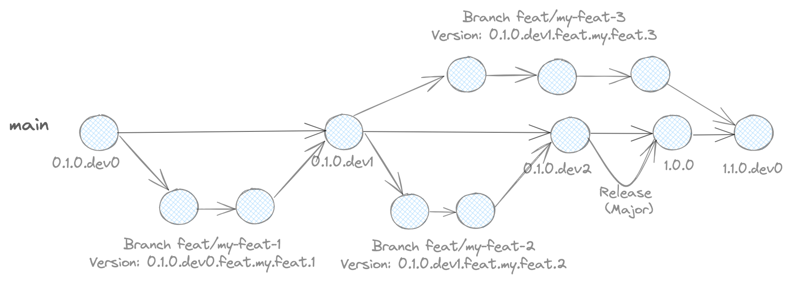
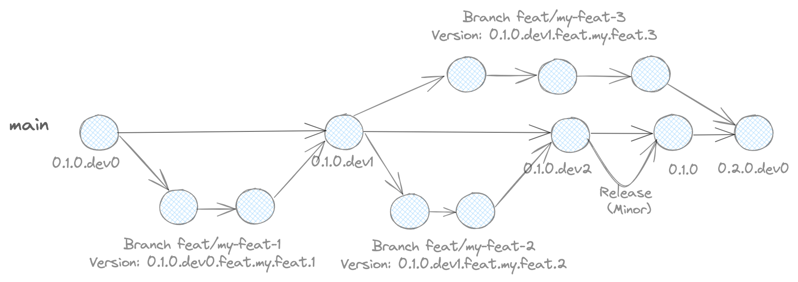

# Qto Categorizer ML

**Qto Categorizer ML** is a CLI-based machine learning system designed to automatically categorize financial transactions for Qto's business customers. Qto offers financial management services to SMEs and freelancers, and accurate transaction categorization is essential to help users understand and control their spending.

Note that this package could replace or complements the existing rule-based system with a more accurate, scalable, and robust ML-based pipeline.

## Table of Contents (ToC)

- [Qto Categorizer ML](#qto-categorizer-ml)
  - [Table of Contents (ToC)](#table-of-contents-toc)
  - [Quick start](#quick-start)
  - [Install](#install)
  - [CLI usage](#cli-usage)
    - [Run training](#run-training)
    - [Run inference (prediction)](#run-inference-prediction)
  - [Contribute](#contribute)
    - [Run tests](#run-tests)
    - [Generate reporters (Sonar)](#generate-reporters-sonar)
    - [Generate Sphinx documentation](#generate-sphinx-documentation)
    - [Bump package version](#bump-package-version)
  - [Code structure](#code-structure)
  - [Release Process](#release-process)
    - [Major Release Process](#major-release-process)
    - [Minor Release Process](#minor-release-process)
  - [Requirements](#requirements)
  - [Notes](#notes)
  - [Useful links](#useful-links)

## Quick start

Clone the repository

```bash
git clone https://github.com/your-org/qto-categorizer-ml.git
cd qto-categorizer-ml
# or pip install qto-categorizer-ml (if used an artifact registry)
```

## Install

```bash
make install
qto-categorizer-ml --help
```

This sets up a virtual environment and installs all dependencies.

## CLI usage

The package is usable as a CLI tool:

```bash
qto-categorizer-ml --help
```

### Run training 

- Baseline:

  ```bash
  qto-categorizer-ml conf/local/training_baseline.yml
  ```

- sklearn pipeline:

  ```bash
  qto-categorizer-ml conf/local/training_sklearn_pipeline.yml
  ```

### Run inference (prediction)

```bash
qto-categorizer-ml conf/local/inference.yml
```

## Contribute

### Run tests

```bash
make check-tests
```

### Generate reporters (Sonar)

```bash
make reporters
```

### Generate Sphinx documentation

```bash
make documenters
open docs/build # open index.html file
```

### Bump package version

```bash
make bump-package PACKAGE_VERSION=0.1.0dev1
```

## Code structure

DDD architecture
  * Reference: <https://en.wikipedia.org/wiki/Domain-driven_design>



```
qto_categorizer_ml/
├── core/               # Core ML logic: pipeline, transformers, models
├── io/                 # Data I/O, including S3 and local handling
├── jobs/               # Hydra jobs for training, inference, etc.
├── utils/              # General-purpose utilities
├── scripts.py          # Manual script calls or debugging helpers
├── settings.py         # Global configuration and constants
├── __main__.py         # Entrypoint for CLI
└── __init__.py
```

## Release Process

### Major Release Process


### Minor Release Process


## Requirements

- Python 3.10+
- `make`
- `pip` or `poetry`

## Notes

- During training, metrics and artifacts are logged into **MLflow** (either local or remote).
- The `conf/` directory holds configuration files for different environments: `local/`, `dev/`, `preprod/`, `prod/`, etc.
- Remote environments may use:
  - S3 for data storage (configured via AWS credentials in `env/`)
  - Remote MLflow servers (e.g., Databricks, SageMaker)
  - Environment-specific variables managed through Hydra and `.env` files

## Useful links

- [Github - qto-categorizer-ml](https://github.com/data-corentinv/qto-categorizer-ml)
- [Github - qto-categorizer-api](https://github.com/data-corentinv/qto-categorizer-api)
- [Github -qto-categorizer-depl](https://github.com/data-corentinv/qto-categorizer-depl)
